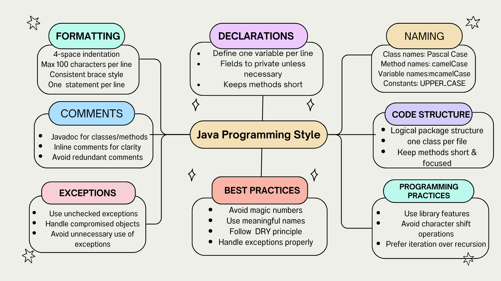

# SEP Project – TanCalculator GUI

## Project Overview
This project implements a **Java Swing-based GUI application** to compute the tangent of an angle (in radians) using **Taylor series approximation**.  
The application has been progressively enhanced to meet various software engineering principles, accessibility standards, and academic requirements.

---

## Features
- **Tangent Calculation** using custom `sin(x)` and `cos(x)` implementations with Taylor series.
- **User-Friendly GUI** built with Java Swing.
- **Input Validation** to handle incorrect or invalid user entries.
- **Accessibility Support** using the Java Accessibility API.
- **Semantic Versioning** implemented (current version: `1.0.0`).
- **UI/UX Principles** applied for better usability and design consistency.
- **Javadoc Documentation** for maintainability.
- **Unit Tests** written in JUnit with all tests passing.

---

## Technologies Used
- **Java 21** (Core logic and GUI)
- **Java Swing** (User Interface)
- **JUnit 5** (Unit Testing)
- **Checkstyle** (Code Style Validation – Google Java Style Guide)
- **SonarLint** (Static Code Analysis)
- **Git + GitHub** (Version Control & Collaboration)

---

---

##  Mind Map – Programming Style
The project follows the **Google Java Style Guide**, represented in the mind map below:



---

## Screenshots
- **Checkstyle Passed**
- **SonarLint Issues Fixed**
- **Debugger Usage**
- **JUnit Tests Passing**
- **Final GUI**

*(All screenshots are in the `Screenshots` folder.)*

---

## Installation & Running
1. Clone the repository:
   ```bash
   git clone https://github.com/Sush0420/SEP_PROJECT.git
   cd SEP_PROJECT

2. Compile the code:
   ```bash
   javac -d out src/main/java/soen_project/TanCalculatorGui.java

3. Run the program:
   ```bash
   java -cp out soen_project.TanCalculatorGui

---

## Development Milestones
Mind Map – Added for programming style.

Checkstyle Integration – Code formatted to match Google Java Style Guide.

Debugger Integration – JDB used to verify code execution.

Static Code Analysis – SonarLint used to find and fix issues.

Semantic Versioning – Version tag added (1.0.0).

UI/UX Principles Applied – Improved layout, tooltips, and design consistency.

Accessibility Support – Added accessible names and descriptions.

JUnit Testing – Unit tests implemented and passed successfully.


## Author
Sushmitha Tiwari Ganga

Master’s in Software Engineering – Concordia University

## License
This project is for academic purposes and is not licensed for commercial use.
